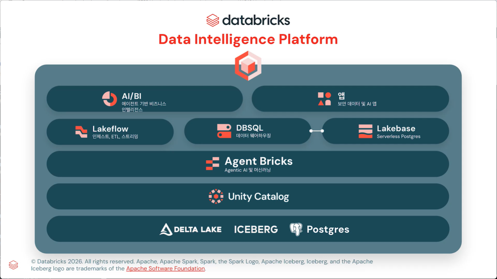

# 2026-06-29. Databricks Data Intelligence Platform — "Lakehouse" 그 다음을 읽다

> 저장 포맷 → 거버넌스 → AI → 처리 → 소비. 한 장의 아키텍처 그림에 담긴 Databricks의 야망.
>
> 우리가 곧 SI로 들어갈 그 플랫폼은, 사실 "데이터 레이크 + 웨어하우스"를 넘어 무엇을 노리고 있나.



---

## 목차

1. [도입: 왜 "Lakehouse"가 아니라 "Data Intelligence Platform"인가](#1-도입-왜-lakehouse가-아니라-data-intelligence-platform인가)
2. [그림 읽는 법 — 5개 층, 하나의 논리](#2-그림-읽는-법--5개-층-하나의-논리)
3. [1층 — 열린 저장 포맷: Delta Lake · Iceberg · Postgres](#3-1층--열린-저장-포맷-delta-lake--iceberg--postgres)
4. [2층 — Unity Catalog: 모든 것을 꿰는 거버넌스 척추](#4-2층--unity-catalog-모든-것을-꿰는-거버넌스-척추)
5. [3층 — Agent Bricks: 데이터 위에서 자라는 AI](#5-3층--agent-bricks-데이터-위에서-자라는-ai)
6. [4층 — 처리/서빙 삼총사: Lakeflow · DBSQL · Lakebase](#6-4층--처리서빙-삼총사-lakeflow--dbsql--lakebase)
7. [5층 — 소비의 끝단: AI/BI 와 앱(Apps)](#7-5층--소비의-끝단-aibi-와-앱apps)
8. [관통하는 한 단어 — "Intelligence"](#8-관통하는-한-단어--intelligence)
9. [정리 & SI 관점의 시사점](#9-정리--si-관점의-시사점)
10. [더 살펴볼 자료](#10-더-살펴볼-자료)

---

## 1. 도입: 왜 "Lakehouse"가 아니라 "Data Intelligence Platform"인가

Databricks를 한 줄로 설명하던 단어는 **Lakehouse**였다. "데이터 레이크(값싸고 유연한 저장)와 데이터 웨어하우스(빠르고 정형화된 분석)를 하나로 합친다" — 이 한 문장이 지난 몇 년간 회사의 정체성이었다.

그런데 이 그림의 제목은 더 이상 Lakehouse가 아니다. **Data Intelligence Platform**이다. 단어가 바뀐 건 마케팅 때문이 아니다. **레이크하우스는 이제 "바닥"이 됐고, 그 위에 AI가 올라앉았다**는 선언이다.

핵심 발상은 이렇다.

> Lakehouse는 *데이터를 한곳에 모으는* 문제를 풀었다.
> Data Intelligence Platform은 *그 데이터를 AI가 이해하게 만드는* 문제를 푼다.

즉, "데이터를 저장·분석하는 플랫폼"에서 "**데이터의 의미를 이해하고 그 위에서 에이전트가 일하는 플랫폼**"으로 무게중심을 옮겼다. 이 그림의 모든 층은 결국 맨 위 두 박스 — **AI/BI와 AI 앱** — 를 떠받치기 위해 존재한다. 이번 리뷰는 그 층을 하나씩 벗겨내며 "Databricks가 도대체 무엇을 하고 싶은 건지"를 명확하게 짚는다.

---

## 2. 그림 읽는 법 — 5개 층, 하나의 논리

그림은 위아래로 쌓인 박스들이지만, **이해는 아래에서 위로** 해야 한다. 데이터가 흐르는 방향이 그렇기 때문이다.

| 층 | 구성요소 | 한 줄 역할 | 비유 |
|----|----------|-----------|------|
| **5층 (소비)** | AI/BI · 앱(Apps) | 사람·고객이 데이터와 만나는 접점 | 매장 진열대 |
| **4층 (처리/서빙)** | Lakeflow · DBSQL · Lakebase | 데이터를 넣고·가공하고·되돌려주는 엔진 | 주방·물류 |
| **3층 (지능)** | Agent Bricks | 데이터 위에서 AI/ML을 만드는 곳 | 레시피 개발실 |
| **2층 (거버넌스)** | Unity Catalog | 모든 데이터·AI 자산의 통제·보안·검색 | 창고 관리·보안실 |
| **1층 (저장)** | Delta Lake · Iceberg · Postgres | 데이터가 실제로 누워 있는 열린 포맷 | 식자재 냉장고 |

읽는 순서의 핵심:

- **아래 두 층(1·2층)은 "기반(foundation)"** 이다. 어떤 포맷이든 받아주고(1층), 무엇이 어디 있고 누가 봐도 되는지 통제한다(2층).
- **가운데 층(3층 Agent Bricks)이 이 그림의 새 주인공**이다. 과거 Databricks 그림에는 없던 자리다. 데이터 바로 위에 AI를 박아 넣었다.
- **위 두 층(4·5층)은 "활용"** 이다. 데이터를 흐르게 하고(Lakeflow), 분석하고(DBSQL), 앱에 되먹이고(Lakebase), 끝내 사람과 고객에게 닿는다(AI/BI·앱).

그림 중앙의 **DBSQL ↔ Lakebase를 잇는 짧은 선**(그림의 가운데 연결고리)도 의미심장하다. 분석용 DB(DBSQL)와 운영용 DB(Lakebase)가 더 이상 분리된 섬이 아니라는 신호다. 뒤에서 자세히 다룬다.

---

## 3. 1층 — 열린 저장 포맷: Delta Lake · Iceberg · Postgres

가장 아래, 모든 것이 시작되는 곳. 여기서 Databricks가 던지는 메시지는 단 하나다: **"포맷 종속(lock-in)을 만들지 않겠다."**

### 3.1 세 가지 포맷이 한 줄에 놓인 이유

- **Delta Lake** — Databricks가 만든 오픈 테이블 포맷. ACID 트랜잭션, 타임트래블, 스키마 강제 등 "레이크 위에 웨어하우스 신뢰성"을 얹은 원조.
- **Apache Iceberg** — Netflix가 만들고 Snowflake·AWS 등 *경쟁 진영*이 미는 오픈 테이블 포맷. 업계 사실상 표준의 또 다른 축.
- **Postgres** — 테이블 포맷이 아니라 **운영(OLTP) 데이터베이스**. 앱이 실시간으로 읽고 쓰는 트랜잭션 데이터의 세계.

### 3.2 핵심 통찰 — "Iceberg를 끌어안은 것"이 전략의 전부

원래 Delta Lake와 Iceberg는 **경쟁 포맷**이었다. 그런데 Databricks는 2025년 Data + AI Summit에서 **Iceberg 완전 지원(managed Iceberg tables)**을 발표했다. Trino·Snowflake·Amazon EMR 같은 외부 엔진이 Unity Catalog를 통해 Iceberg 테이블을 직접 읽고 쓸 수 있게 한 것이다.

> 메시지: "당신 데이터가 Delta든 Iceberg든 상관없다. 우리는 포맷이 아니라 **그 위의 지능**을 판다."

이건 자신감의 표현이다. 저장 포맷에서 돈을 벌던 시대를 스스로 끝내고, 경쟁 우위를 **상위 층(거버넌스 + AI)**으로 올렸다는 뜻이다. SI 관점에서도 중요하다 — 고객이 이미 Iceberg/Snowflake에 데이터를 쌓아뒀어도 "갈아엎지 않고" 얹을 수 있다는 영업 논리가 여기서 나온다.

### 3.3 Postgres가 여기 있는 이유

전통적으로 분석 플랫폼 그림에 **운영 DB(Postgres)**가 같은 바닥 층에 등장하는 건 이례적이다. 이건 4층의 **Lakebase**(서버리스 Postgres)와 직결된다. "분석 데이터(OLAP)와 운영 데이터(OLTP)를 같은 바닥에 두겠다"는 의도 — 즉 **OLTP와 OLAP의 경계를 허물겠다**는 선언이 1층부터 깔려 있다.

---

## 4. 2층 — Unity Catalog: 모든 것을 꿰는 거버넌스 척추

1층이 "무엇으로 저장하나"라면, 2층은 "**그것을 어떻게 통제하나**"이다. 그림에서 Unity Catalog가 **가로로 길게 모든 것을 받치고 있는** 구도는 의도된 것이다. 이게 플랫폼의 **척추(backbone)**다.

### 4.1 Unity Catalog가 실제로 하는 일

- **단일 거버넌스** — 테이블·파일·ML 모델·노트북·대시보드·**AI 에이전트**까지, 모든 자산의 권한·계보(lineage)·감사(audit)를 한곳에서.
- **포맷·엔진 중립** — Delta는 Unity REST API로, Iceberg는 Iceberg REST Catalog API로 접근. **외부 엔진(Trino, Snowflake, EMR…)에도 같은 권한 정책을 강제**한다. 자격증명 대여(credential vending)로 보안을 유지한 채.
- **Lakehouse Federation** — AWS Glue, Hive Metastore, Snowflake Horizon 같은 **남의 카탈로그**에 있는 데이터도 옮기지 않고 그 자리에서 거버넌스.

### 4.2 핵심 통찰 — "AI 시대의 거버넌스는 보안이 아니라 '문맥'이다"

과거 카탈로그는 "누가 무엇을 볼 수 있나"(보안)가 전부였다. Unity Catalog의 야망은 다르다. **AI 에이전트에게 신뢰할 수 있는 단일한 문맥(context)을 제공하는 것**이다.

> 에이전트가 "지난 분기 매출"을 물으면, *어느 테이블이 진짜 매출인지, 그걸 봐도 되는 사람인지, 그 수치가 어디서 왔는지*를 한 번에 알아야 한다.
> 그 "단일한 진실의 출처"가 바로 Unity Catalog다.

그래서 2층은 단순한 보안실이 아니라, **3층(Agent Bricks)과 5층(AI/BI)이 헛소리를 하지 않게 만드는 근거지**다. 거버넌스가 곧 AI 품질의 전제 조건이 된 셈이다. 이 통찰이 이 플랫폼 전체에서 가장 중요하다.

---

## 5. 3층 — Agent Bricks: 데이터 위에서 자라는 AI

이 그림에서 **가장 새롭고, 가장 핵심적인 자리**. 데이터(1·2층) 바로 위에 AI가 박혀 있다. "AI를 별도 시스템으로 붙이는 게 아니라, 데이터 플랫폼의 일부로 둔다" — 이것이 Data Intelligence Platform의 정체성이다.

### 5.1 Agent Bricks가 푸는 문제

기업이 AI 에이전트를 직접 만들 때 가장 어려운 건 모델 선택이 아니라 **"우리 데이터에 맞게 튜닝하고, 품질을 객관적으로 측정하는 것"**이다. Agent Bricks는 이를 자동화한다.

- 사용자는 **"이런 일을 하는 에이전트가 필요해"**라는 설명 + 자사 데이터만 연결.
- 그러면 Databricks가 **도메인 특화 합성 데이터(synthetic data)**와 **과제별 벤치마크**를 자동 생성.
- 프롬프트 엔지니어링·파인튜닝·리워드 모델·TAO(Test-time Adaptive Optimization) 등 **여러 최적화 기법을 자동으로 조합·탐색**해 품질을 끌어올린다.
- 비용 최적화 모델 / 품질 최적화 모델 중 선택 가능 — DIY보다 더 싸고 더 좋은 결과를 노린다.

### 5.2 규모로 보는 진심

- 2025년 6월 출시 이후 **10만 개 이상의 에이전트**가 만들어졌고,
- Databricks는 에이전트만으로 **연 1천조(1 quadrillion) 토큰 이상**을 처리하고 있다.
- 2026년에는 OpenAI·Anthropic·Gemini·Qwen·Kimi, 그리고 **SpaceX 제휴를 통한 Grok**까지 프런티어 모델을 폭넓게 지원하고, LangGraph·CrewAI·Claude Code SDK·OpenAI Agent SDK 등 외부 하니스(harness)도 끌어안는 **개방형 에이전트 플랫폼**으로 확장됐다.

### 5.3 핵심 통찰 — "모델이 아니라 데이터가 해자(moat)다"

OpenAI·Anthropic이 더 좋은 모델을 만드는 경쟁이라면, Databricks의 전략은 다르다.

> "최고의 모델은 우리가 안 만든다. 대신 *당신의 데이터로 그 모델을 최적화*하는 일은 우리가 제일 잘한다."

모델은 누구나 API로 부른다. 하지만 *기업의 데이터·거버넌스·문맥*은 그 회사 안에만 있다. Agent Bricks는 그 데이터(1층)와 문맥(2층)을 그대로 끌어와 AI를 만든다. **데이터가 있는 곳에서 AI를 키운다** — 이게 모델 회사들이 흉내 내기 어려운 해자다.

---

## 6. 4층 — 처리/서빙 삼총사: Lakeflow · DBSQL · Lakebase

데이터를 **넣고(Lakeflow) → 분석하고(DBSQL) → 앱에 되먹이는(Lakebase)** 세 엔진. 그림에서 이 셋이 나란히 놓이고, 가운데 DBSQL과 Lakebase가 선으로 연결된 게 포인트다.

### 6.1 Lakeflow — "데이터 엔지니어링을 하나로"

흩어져 있던 수집·변환·오케스트레이션을 한 우산으로 묶은 통합 데이터 엔지니어링 도구.

- **Lakeflow Connect** — Salesforce·Workday·SQL Server 등 **100개 이상 소스**에 대한 관리형 커넥터. 고볼륨 이벤트는 **Zerobus**로 스트리밍.
- **Lakeflow Declarative Pipelines** — 기존 DLT(Delta Live Tables)의 후계. 선언형으로 ETL을 정의하면 데이터 품질·CDC가 자동.
- **Lakeflow Jobs** — 워크플로 오케스트레이션.
- **Real-Time Mode(RTM)** — 스트리밍 파이프라인의 실시간 모드(Public Preview).
- 핵심: **모든 것이 Unity Catalog 거버넌스 아래** → 도구 난립(tool sprawl)을 없애고 에이전트에게 "단일한 실시간 문맥"을 준다.

### 6.2 DBSQL — "레이크 위의 웨어하우스"

데이터 웨어하우징 엔진. 원래 Databricks가 "Lakehouse"라 부를 때 그 *house(웨어하우스)* 부분이 바로 이것. 표준 SQL로 BI·리포팅·애드혹 분석을 처리하는, 검증된 OLAP 엔진이다.

### 6.3 Lakebase — "이 그림에서 가장 도발적인 카드"

**서버리스 Postgres**. 2025년 발표된 가장 큰 베팅 중 하나다.

- Databricks가 **2025년 5월 약 10억 달러에 인수한 Neon** 엔진 기반. Neon은 **컴퓨트와 스토리지를 완전히 분리**한 클라우드 네이티브 Postgres.
- 쓰지 않으면 0으로 줄고(scale to zero), 부하가 오면 즉시 확장 → **버스티한 워크로드, 개발 환경, 그리고 에이전트가 잠깐 띄우는 임시 인스턴스**에 최적.
- 결정적 차별점: **레이크하우스와 같은 저장 층을 공유**한다. 운영 데이터(OLTP)를 ETL로 옮기지 않고도 Spark·DBSQL이 바로 분석.

### 6.4 핵심 통찰 — "OLTP와 OLAP의 휴전선을 지운다"

수십 년간 데이터 세계는 둘로 쪼개져 있었다. **운영 DB(OLTP, 앱이 실시간으로 쓰는 곳)**와 **분석 DB(OLAP, 의사결정을 위해 모아 보는 곳)**. 둘 사이엔 늘 ETL이라는 국경 검문소가 있었고, 데이터는 거기서 지연되고 복제됐다.

> Lakebase는 그 국경을 없앤다.
> 그림 중앙의 **DBSQL ↔ Lakebase 연결선**이 바로 그 휴전 협정이다.

왜 중요한가? **AI 에이전트는 실시간으로 읽고 쓸 운영 DB가 필요**하기 때문이다. 에이전트가 주문을 처리하거나 상태를 기록하려면 OLTP가 있어야 하고, 동시에 그 데이터를 즉시 분석(OLAP)해야 한다. Lakebase는 "에이전트 시대의 운영 DB"를 레이크하우스 안으로 끌어들인 것이다. 1층에 Postgres가 있던 이유가 여기서 완성된다.

---

## 7. 5층 — 소비의 끝단: AI/BI 와 앱(Apps)

밑의 모든 층은 결국 **사람과 고객이 데이터를 쓰게** 하기 위해 존재한다. 그 접점이 5층이다.

### 7.1 AI/BI — "에이전트 기반 비즈니스 인텔리전스" (그림 좌상단)

Databricks의 BI 시장 진출. 두 얼굴을 가진다.

- **Dashboards** — 전통적 BI 경험(차트·리포트).
- **Genie** — **자연어 대화형 분석**. "내 영업 파이프라인 어때?"라고 물으면 텍스트 요약 + 표 + 시각화로 답한다. 추가 라이선스 없이 DBSQL 고객에게 제공.

여기서 "**Agentic BI**"가 핵심 단어다. 정적인 대시보드를 넘어, **에이전트가 다단계 추론(multi-step reasoning)과 가설 검증**으로 스스로 데이터를 파고든다(Genie의 Research Agent). 사람이 질문을 다듬는 게 아니라, **에이전트가 질문을 다듬어가며** 답을 찾는다.

> "차트를 보는 BI"에서 "**물어보면 분석가처럼 일해주는 BI**"로.

### 7.2 앱(Apps) — "보안 데이터 및 AI 앱" (그림 우상단)

플랫폼 위에서 바로 **데이터·AI 애플리케이션을 만들고 배포**하는 영역. Unity Catalog로 데이터가 거버넌스되고(2층), Lakebase가 트랜잭션 층을 맡고(4층), Agent Bricks가 지능을 공급(3층)한다. 즉 앱은 **아래 모든 층의 종착점**이다. 외부 사용자에게도 Databricks 계정 없이 OAuth 토큰으로 안전하게 임베딩할 수 있다.

### 7.3 핵심 통찰 — "데이터가 사람을 찾아온다"

전통 BI는 사람이 데이터를 찾아가야 했다(대시보드를 열고, 필터를 만지고, SQL을 짜고). 5층의 방향은 반대다.

> 사람은 **자연어로 묻기만** 하고, 앱은 **알아서 모니터링하고 알려준다**.
> 데이터 활용의 진입 장벽이 "SQL을 아는 사람"에서 "**질문할 줄 아는 모든 사람**"으로 내려온다.

이게 맨 위 두 박스가 그림의 *목적지*인 이유다. 아래 네 층의 모든 정교함은, 결국 비전문가가 데이터와 자연스럽게 대화하게 만들기 위한 것이다.

---

## 8. 관통하는 한 단어 — "Intelligence"

이제 그림 전체를 다시 보자. 다섯 층을 위아래로 관통하는 논리는 하나다.

```
        [ 사람·고객 ]
             ↑  자연어로 묻는다
  5층  AI/BI · 앱        ← 누구나 데이터와 대화
             ↑
  4층  Lakeflow·DBSQL·Lakebase  ← 넣고·분석하고·되먹인다 (OLTP=OLAP)
             ↑
  3층  Agent Bricks      ← 데이터 위에서 AI가 자란다 (해자)
             ↑
  2층  Unity Catalog     ← 단일 거버넌스 = AI의 '문맥'이자 신뢰
             ↑
  1층  Delta·Iceberg·Postgres  ← 열린 포맷, 종속 없음
        [ 데이터 ]
```

- **1층의 메시지**: 포맷에 가두지 않는다. (개방성)
- **2층의 메시지**: 모든 자산을 하나로 통제·이해한다. (신뢰·문맥)
- **3층의 메시지**: 모델이 아니라 *데이터*가 무기다. (해자)
- **4층의 메시지**: 운영과 분석의 경계를 지운다. (실시간 + 에이전트 친화)
- **5층의 메시지**: 데이터 활용을 모두에게 연다. (대중화)

Lakehouse가 "**데이터를 한곳에**"였다면, Data Intelligence Platform은 "**그 데이터를 AI가 이해하고, 그 AI를 모두가 쓴다**"이다. 그래서 제목의 단어가 *Lake*에서 *Intelligence*로 바뀐 것이다. Databricks가 하고 싶은 것은 한 문장으로 이렇다:

> **"기업의 데이터를, 그 기업만의 지능으로 바꾸는 단 하나의 플랫폼이 되는 것."**

---

## 9. 정리 & SI 관점의 시사점

**정리:**

- Databricks는 "Lakehouse(저장·분석 통합)"를 **기반(아래 두 층)으로 내리고**, 그 위에 **AI 지능(Agent Bricks)**을 새 주인공으로 올렸다. 이름이 *Data Intelligence Platform*으로 바뀐 이유다.
- 진짜 무기는 모델이 아니라 **데이터 + 거버넌스(문맥)**다. Unity Catalog가 척추 역할로 모든 층을 신뢰 가능하게 묶는다.
- **Iceberg 완전 지원**과 **Lakebase(서버리스 Postgres)**는 각각 "포맷 종속 해제"와 "OLTP=OLAP 통합"이라는 두 개의 벽을 허무는 결정타다.
- 종착점은 **AI/BI·앱** — 비전문가가 자연어로 데이터와 대화하는 세계다.

**우리 SI 프로젝트에 주는 시사점 (토론 포인트):**

- **마이그레이션 부담 완화 논리**: 고객이 Snowflake/Iceberg/Glue에 이미 데이터가 있어도, "옮기지 않고" 거버넌스·AI를 얹는 영업 시나리오가 가능하다. (Lakehouse Federation + Iceberg 지원)
- **차별화 포인트**: 단순 데이터 웨어하우스 구축이 아니라, **Agent Bricks 기반 도메인 에이전트**까지 포함한 제안이 Databricks의 진짜 강점을 산다. "데이터 모아드립니다"가 아니라 "데이터로 *지능*을 만들어드립니다".
- **검증 필요**: Lakebase·Agent Bricks 등은 비교적 최신(2025~2026 GA/Preview)이므로, 실제 PoC에서 성숙도·리전 지원·가격 모델을 반드시 확인할 것.

> **토론거리:** 우리 첫 Databricks SI 고객에게 이 5층 중 *어디서부터* 들어가는 게 맞을까?
> 안전하게 1·2층(레이크하우스 + 거버넌스)부터인가, 아니면 처음부터 3·5층(에이전트·AI/BI)을 미끼로 거는 게 차별화일까?

---

## 10. 더 살펴볼 자료

- [Introducing Agent Bricks: Auto-Optimized Agents Using Your Data (Databricks Blog)](https://www.databricks.com/blog/introducing-agent-bricks)
- [Agent Bricks: Data + AI Summit 2026 (Databricks Blog)](https://www.databricks.com/blog/agent-bricks-dais-2026)
- [A New Era of Databases: Lakebase (Databricks Blog)](https://www.databricks.com/blog/what-is-a-lakebase)
- [Announcing Lakebase Public Preview (Databricks Blog)](https://www.databricks.com/blog/announcing-lakebase-public-preview)
- [Introducing Databricks Lakeflow: A unified, intelligent solution for data engineering (Databricks Blog)](https://www.databricks.com/blog/introducing-databricks-lakeflow)
- [Lakeflow: A new era of agentic data engineering (Databricks Blog)](https://www.databricks.com/blog/lakeflow-new-era-agentic-data-engineering)
- [Announcing full Apache Iceberg™ support in Databricks (Databricks Blog)](https://www.databricks.com/blog/announcing-full-apache-iceberg-support-databricks)
- [What's new with Databricks Unity Catalog at Data + AI Summit 2025 (Databricks Blog)](https://www.databricks.com/blog/whats-new-databricks-unity-catalog-data-ai-summit-2025)
- [AI/BI Genie is now Generally Available (Databricks Blog)](https://www.databricks.com/blog/aibi-genie-now-generally-available)
- [Agentic BI: A Practical Guide for BI Teams and Business Users (Databricks Blog)](https://www.databricks.com/blog/what-is-agentic-bi)
